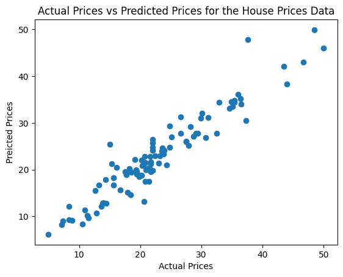

# 🏡 Boston Housing Price Prediction with XGBoost

A complete machine learning pipeline using **XGBoost Regressor** to predict house prices in Boston, based on 13 socioeconomic and environmental features. This project demonstrates clean code, reproducibility, performance metrics, and professional ML workflow — suitable for portfolios, recruiters, and real-world applications.

---

## 📈 Project Summary

| Category      | Details                                                                                |
| ------------- | -------------------------------------------------------------------------------------- |
| 📊 Dataset    | [Boston Housing Dataset (CMU StatLib)](http://lib.stat.cmu.edu/datasets/boston)        |
| 📌 Goal       | Predict median house value (in \$1000s) using features like crime rate, rooms, and tax |
| ⚙️ Model      | Gradient Boosted Trees with XGBoost Regressor                                          |
| 🧪 Evaluation | R² Score, MAE (Mean Absolute Error), Visualizations                                    |
| 🛠️ Tools      | Python, Pandas, Scikit-learn, XGBoost, Seaborn, Matplotlib                             |
| 💼 Author     | Samar Ranjit (Undergraduate Research Assistant, Texas State University)                |

---

## 💻 Project Highlights

- ✔️ Manual loading and preprocessing from raw dataset URL
- ✔️ Correlation heatmap for feature understanding
- ✔️ Model training & evaluation with high R² performance
- ✔️ Well-documented, professional Jupyter notebook
- ✔️ Runs cleanly in both Google Colab & local virtual environments

---

## 📈 Model Performance

| Dataset  | R² Score  | Mean Absolute Error (MAE) |
| -------- | --------- | ------------------------- |
| Training | 0.9999 ✅ | \$91.33                   |
| Testing  | 0.9051 ✅ | \$2,074.87                |

> 🔍 The model demonstrates strong generalization to unseen data with minimal prediction error for a complex real-world dataset.

---

## 🚀 Getting Started

### 1. 📦 Clone the Repository

```bash
git clone https://github.com/your-username/boston-housing-regression.git
cd boston-housing-regression
```

### 2. 🧪 Create and Activate Virtual Environment

```bash
# Create virtual environment
python -m venv venv

# Activate it
# For macOS/Linux:
source venv/bin/activate

# For Windows:
venv\Scripts\activate
```

### 3. 📚 Install Dependencies

```bash
pip install -r requirements.txt
```

### 4. 📓 Launch Jupyter Notebook

```bash
jupyter notebook
```

Then open and run `boston_housing_xgboost_regression.ipynb`.

---

## 📁 Repository Structure

```bash
boston-housing-regression/
├── boston_housing_xgboost_regression.ipynb  # 📓 Main notebook
├── requirements.txt                         # 📆 Python dependencies
├── README.md                                # 📅 Project documentation
├── .gitignore                               # 🔒 Ignore venv, cache files
└── LICENSE                                  # 📜 MIT open-source license
```

---

## 📦 Dependencies

Listed in `requirements.txt`:

- `pandas`
- `numpy`
- `matplotlib`
- `seaborn`
- `scikit-learn`
- `xgboost`

To install all dependencies:

```bash
pip install -r requirements.txt
```

---

## 📚 Key Learnings

- How to parse and structure multi-line dataset from a raw text URL
- Using correlation heatmaps to guide feature selection
- Training and evaluating regression models with scikit-learn and XGBoost
- Identifying overfitting through R² and MAE differences
- Writing production-ready, reproducible notebooks for GitHub portfolios

---

## 📸 Example Visualizations

## 

## 📜 License

This project is licensed under the **MIT License** — see the [LICENSE](LICENSE) file for details.

---

## 🙋‍♂️ About the Author

**Samar Ranjit**
📍 Undergraduate Research Assistant | Texas State University
🔭 Exploring ML, AI, and Geospatial Analytics in Agriculture
🔗 [LinkedIn](https://www.linkedin.com/in/samar-ranjit)
📨 Email: [samar.ranjit@txstate.edu](mailto:samar.ranjit@txstate.edu)

---

## 🌟 Want to Support or Collaborate?

- ⭐ Star this repo if you found it useful
- 🧐 Reach out if you'd like to collaborate on ML or geospatial research
- 💼 Open to internships and research roles in AI, ML, or environmental data science
